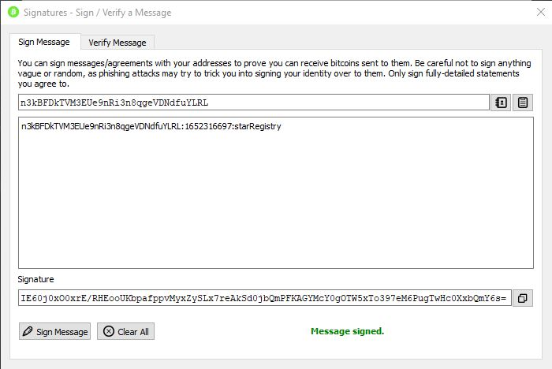

# Project: Private Blockchain
## Overview
This project demonstrates the following fundamental concepts of a Blockchain platform:
- Block
- Blockchain
- Wallet
- Blockchain Identity
- Proof of Existance
## Project Purpose
Proof of concept on how a Blockchain application can be implemented.  Astronomy fans can use this application to register and track ownership of stars in the sky.
## Project Implementation
This project was created using the **Blockchain P1 project boilerplate code** provided by Udacity.
This application is built on `Node.js` and `Express`. The architecture will use ES6 classes because it will help us to organize the code and facilitate the maintenance of the code.
## Project Dependencies
- `bitcoinjs-lib` and `bitcoinjs-message` will help us verify wallet address ownership and signatures. **Note**: Make sure to always use Legacy Wallet addresses.
- `express` is a node framework used to create The REST Api used in this project
- `body-parser` is used as a middleware module for Express and will help us to read the `json` data submitted in a POST request.
- `crypto-js` is a module containing some of the most important cryptographic methods and will help us create the block hash.
- `hex2ascii` will help us **decode** the data saved in the body of a Block.
- `typescript` this project is compiled with typescript
- `jest` is a testing framework.  This project has a full unit and integration test suite
## Data Model
### Transaction
```json
{
  "star": {
    "dec": "68° 52' 56.9",
    "ra": "16h 29m 1.0s",
    "story": "Testing the story 4"
  }
}
```
### Message
`<WALLET_ADRESS>:${new Date().getTime().toString().slice(0,-3)}:starRegistry;`
## How to install and run the application
1. Make sure `Node.js` is installed (https://nodejs.org/)
2. Run `npm install` from the project directory
3. To test the application run `npm test'
4. To run the application run `npm dev`
## How to use the application
1. The application will create a Genesis Block when it first runs
2. The user will request the application to send a message to be signed using a Wallet and in this way verify the ownership over the wallet address.
3. Once the user has the message they can use a Wallet (Electrum or Bitcoin Core for example) to sign the message.
4. The user will try to submit the Star object for that. The submission will consist of: `wallet address`, `message`, `signature` and the `star` object with the star information.
5. The application will verify if the time elapsed from the request ownership (the time is contained in the message) and the time when you submit the star is less than 5 minutes.
6. If everything is okay the star information will be stored in the block and added to the `chain` encoding the Star information.
7. The application will allow us to retrieve the Star objects belong to an owner (wallet address). This information should be human readable so it shouldn't be encoded.
## Application Run Example
1. Run the application using `npm dev`.  You should see in your terminal a message indicating that the server is listening in port 8000:
    
    `Server Listening for port: 8000`

2. To make sure your application creates the Genesis Block you can use POSTMAN to request the Genesis block with the following endpoint: `http://localhost:8000/block/height/0`

    

3. Request ownership of your wallet address with `POST` endpoint: `http://localhost:8000/requestValidation`.  Add your wallet address to the post body.

   **Note:** If using Bitcoin Core, you must add `addresstype=legacy` to your `bitcoin.conf` file.

   

4. Sign the message with your Wallet:

   

5. Submit your Star using `POST` request: `http://localhost:8000/submitStar`.  Make sure you add the `address`, `signature`, `message` and `star` to the `POST` body.

   

6. Retrieve owned stars using `GET` request: `http://localhost:8000/blocks/:address`

   